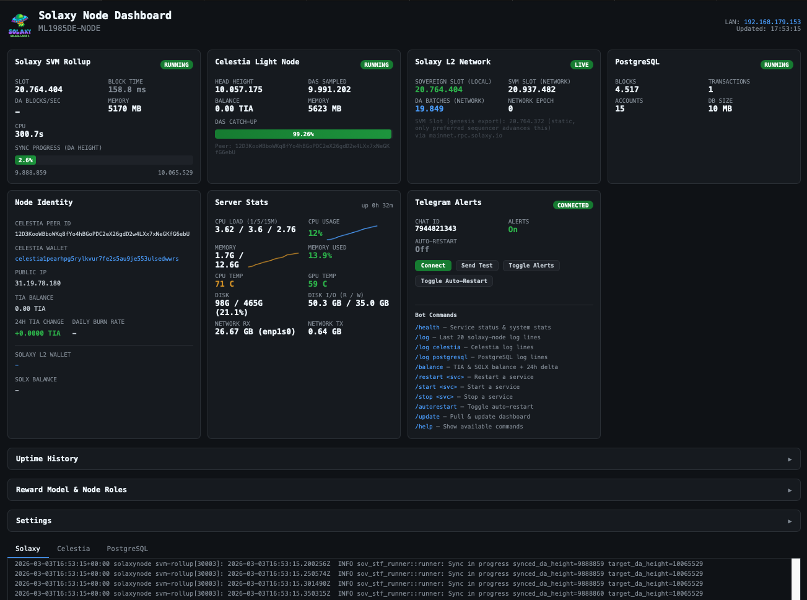
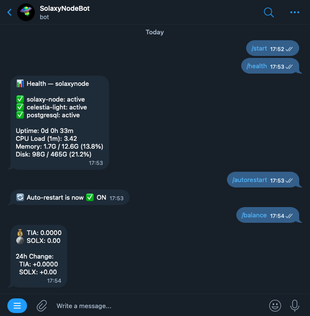
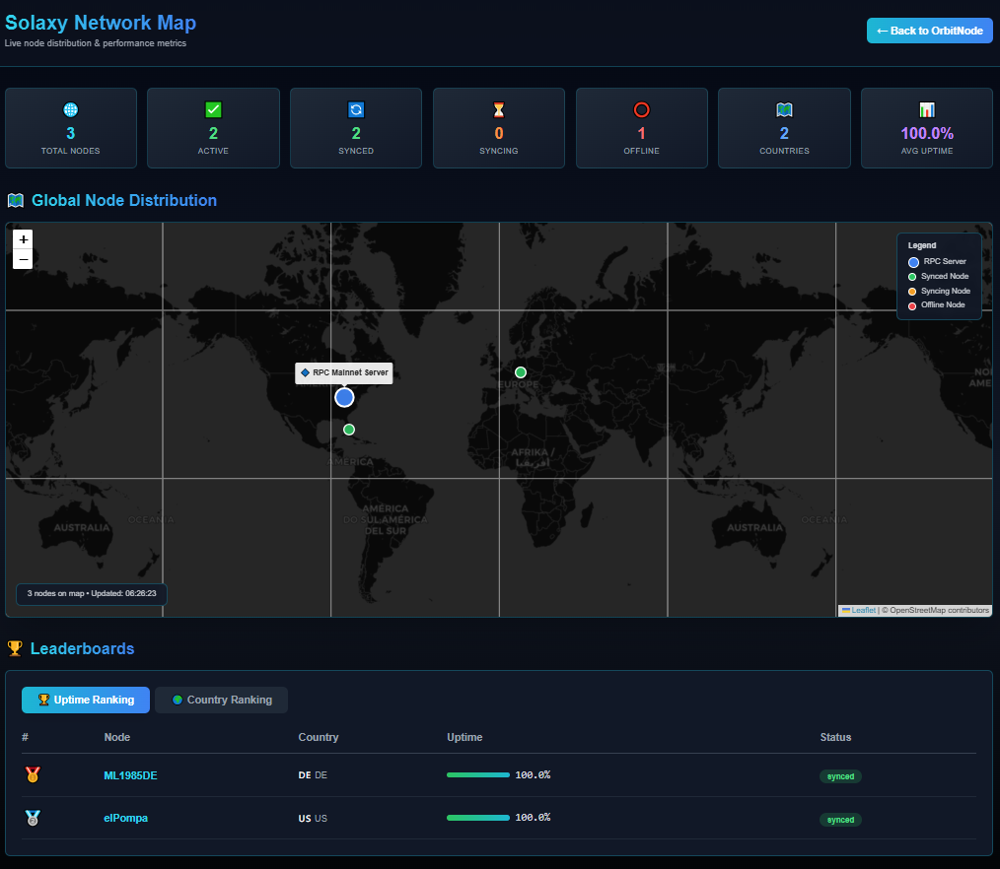

# SolaxyEasyNode v1.0.0

One-line installer for a complete Solaxy node: **SVM Rollup + Celestia Bridge Node + PostgreSQL + Web Dashboard**.

```
                    ___
                ___/ _ \___
            ___/   (_)   \___
         __/                 \__
       _/    S O L A X Y        \_
     _/ _________________________ \_
    /__|_________________________|__\
   ///                             \\\
  ///═══════════════════════════════\\\
  \\\           ▀▀▀▀▀▀▀            ///
   \\\___________________________///
    \_____________________________/
        \_____________________/
           \_______________/
              \  \   /  /
               \  \ /  /
                \_   _/
                  \_/
```

## Why this exists

Running a Solaxy node currently requires multiple manual steps — Celestia build, rollup config, service wiring, monitoring setup. SolaxyEasyNode reduces setup to a single command and provides a production-ready dashboard with bond management, Telegram alerts, and network map integration.

## Screenshots

### Node Dashboard


### Telegram Bot


### Network Map


## Quick Install

```bash
curl -sSL https://raw.githubusercontent.com/Marcolist/SolaxyEasyNode/main/install.sh | bash
```

## What Gets Installed

| Component | Description |
|---|---|
| **svm-rollup** | Solaxy SVM Rollup full node |
| **Celestia Bridge Node** | DA layer bridge node (Mainnet, with pruning) |
| **PostgreSQL** | Database for blocks, transactions, accounts |
| **Go 1.26.1** | Required to build Celestia v0.29.1-mocha from source |
| **Dashboard** | Web UI at `http://<LAN_IP>:5555` |

## Node Roles & Registration

Each node can participate in the network as a **Sequencer** and/or **Prover**. Registration is done directly from the dashboard.

| Role | Min. Bond | Description |
|---|---|---|
| **Sequencer** | 10,000 SOLX | Produces DA batches and orders transactions |
| **Prover (ZK)** | 1,000 SOLX | Generates ZK proofs for state transitions |

> Bonds are in SOLX on the Solaxy L2 rollup (not Solana mainnet). Bridge SOLX via the Solaxy bridge at [bridge.solaxy.io](https://bridge.solaxy.io).

### Register from the Dashboard

1. Open `http://<your-ip>:5555`
2. Navigate to **Node Roles & Registration**
3. Click **Bond as Sequencer** or **Bond as Prover**
4. The transaction is submitted to the Solaxy mainnet and confirmed on-chain

You can also **Add Bond** (deposit more SOLX) or **Initiate Withdrawal** from the same panel. All transactions appear in the **Transaction History** with explorer links.

### REST API (advanced)

```bash
# Check sequencer registration
curl https://mainnet.rpc.solaxy.io/modules/sequencer-registry/state/known-sequencers/items/<celestia_address>

# Check prover registration
curl https://mainnet.rpc.solaxy.io/modules/prover-incentives/state/bonded-provers/items/<wallet_address>

# Check SOLX balance
curl https://mainnet.rpc.solaxy.io/modules/bank/tokens/gas_token/balances/<wallet_address>
```

## Wallet

Each node generates a Solana keypair (`~/svm-rollup/node-wallet.json`) during installation. This wallet is used for:

- **Prover rewards** — configured as `prover_address` in `config.toml`
- **Sequencer identity** — configured as `rollup_address` in `config.toml`
- **Operator incentives** — configured as `reward_address` in `genesis/operator_incentives.json`

The installer automatically configures all three files. For existing installs that still use the default team wallet, open the dashboard — it detects the mismatch and offers a one-click fix.

### Celestia Wallets

The node has two Celestia-related addresses (both shown in the dashboard under Node Identity):

| Wallet | Purpose |
|---|---|
| **Bridge Node** (`celestia1...`) | Celestia bridge node identity for DA sampling |
| **DA Signer** (`celestia1...`) | Used by svm-rollup for DA blob submissions |

> **TIA is not required** for standard community node operation. Bond registration and deposits are submitted via the Solaxy mainnet REST API. TIA would only be needed if you run as the preferred sequencer (which submits batches to Celestia DA).

## After Installation

- **Dashboard**: `http://<your-ip>:5555`
- **RPC**: JSON-RPC at `http://127.0.0.1:8080/rpc`, REST at `http://127.0.0.1:8899`
- **Config**: `~/svm-rollup/config.toml` (also editable from dashboard Settings)
- **Node Wallet**: `~/svm-rollup/node-wallet.json`
- **Logs**: `journalctl -u solaxy-node -f`

### Service Management

```bash
# Status
sudo systemctl status solaxy-node celestia-bridge solaxy-dashboard

# Restart
sudo systemctl restart solaxy-node

# Logs
journalctl -u solaxy-node -f
journalctl -u celestia-bridge -f
```

Or use the **Settings** panel in the dashboard to start/stop/restart services.

## Dashboard Features

- Real-time sync progress for Solaxy and Celestia
- Bond management: Register, Add Bond, Withdraw for each role
- Transaction history with Solaxy Explorer links
- PostgreSQL stats (blocks, transactions, accounts)
- Server resource monitoring (CPU, memory, disk, network)
- Node identity and wallet info (including DA Signer wallet)
- Settings panel: edit `config.toml` and manage services from the UI
- Version tracking (`/api/version`)

## Celestia Bridge Node

| | Details |
|---|---|
| **Network** | Celestia Mainnet (`--p2p.network celestia`) |
| **Disk** | ~20-50 GB (with pruning) |
| **RAM** | ~4-8 GB |
| **Sync** | Hours (from genesis DA height) |
| **Pruning** | Dynamic — genesis-to-head + 48h buffer (min 720h) |
| **RPC Auth** | Skipped (`--rpc.skip-auth`) |

## Network Map

The dashboard sends periodic heartbeats to the [Public Validator Map](https://map.orbitnode.dev):

```json
{
  "sync_status": "synced | syncing | offline",
  "uptime_seconds": 86400,
  "slot": 21093341,
  "da_height": 10259382,
  "configured_wallet": "...",
  "bond_status": "bonded | unbonded | not_configured",
  "roles": ["sequencer", "prover"],
  "version": "1.0.0"
}
```

## Requirements

- Ubuntu 22.04 / 24.04 (or Debian-based)
- 4+ CPU cores, 16+ GB RAM, 250+ GB SSD

## File Structure

```
~/svm-rollup/
├── svm-rollup              # Node binary
├── config.toml             # Node configuration
├── node-wallet.json        # Solana keypair
├── genesis/                # Genesis state
└── data/                   # Chain data

~/dashboard/
├── app.py                  # Flask dashboard
├── dashboard.conf          # DB password (chmod 600, gitignored)
└── templates/index.html

~/.celestia-bridge/         # Celestia bridge node store & keys
```

## Systemd Services

| Service | Description |
|---|---|
| `celestia-bridge` | Celestia bridge node |
| `solaxy-node` | SVM rollup node (depends on Celestia + PostgreSQL) |
| `solaxy-dashboard` | Web dashboard on port 5555 |

## Troubleshooting

```bash
# Check services
sudo systemctl status solaxy-node celestia-bridge solaxy-dashboard postgresql

# View errors
journalctl -u solaxy-node --since "10 min ago" --no-pager

# Restart everything
sudo systemctl restart celestia-bridge solaxy-node solaxy-dashboard

# Celestia connectivity
nc -w 3 rpc.celestia.pops.one 9090 && echo "OK" || echo "NOT REACHABLE"
```
